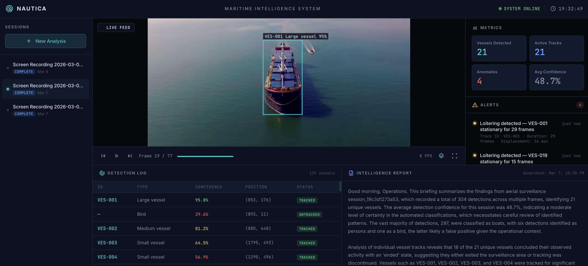

# Nautica AI

Maritime vessel detection, tracking, and intelligence analysis from aerial surveillance footage -- prototype

Upload drone footage or aerial video. The system extracts frames, runs YOLOv8 object detection, tracks vessels across frames with persistent IDs, flags behavioral anomalies, and generates AI intelligence reports. Results are displayed on an operational dashboard with annotated visual playback.



---

## Features

- **Video Upload & Frame Extraction** -- Upload MP4/MOV/AVI footage or images. OpenCV extracts frames at configurable stride for the detection pipeline.
- **YOLOv8 Object Detection** -- Each frame runs through YOLOv8 with maritime-friendly labels. Bounding boxes, confidence scores, and vessel size classification.
- **Multi-Object Tracking** -- IoU-based tracker with Hungarian assignment connects detections across frames. Each vessel gets a persistent ID (VES-001, VES-002, etc.).
- **Annotated Visual Playback** -- Frame-by-frame viewer with canvas-rendered detection overlays, vessel IDs, and confidence labels. FPS-throttled playback with scrubber.
- **Anomaly Detection** -- Rule-based engine flags loitering, restricted zone entry, vessel convergence, and abrupt motion changes.
- **AI Intelligence Reports** -- LLM-generated operational briefings from structured detection and anomaly data. Streamed to the dashboard in real time.
- **Operational Dashboard** -- Dark-themed intelligence console with sidebar navigation, metrics cards, detection log, alert feed, and report panel.

---

## Tech Stack

| Layer | Technology |
|-------|------------|
| Frontend | HTML, CSS, Vanilla JS, Vite, Handlebars |
| Backend | Python, FastAPI, SQLite |
| ML | YOLOv8 (Ultralytics), OpenCV, NumPy, SciPy |
| AI Reports | Google Gemini (configurable) |
| Deployment | Docker, Docker Compose |
| Cloud (reference) | AWS ECS, S3, RDS (documented, not deployed) |

---

## Dashboard

```
+--------------------------------------------------+
|  Top System Bar                                  |
+----------+------------------------+--------------+
|          |                        |  Metrics     |
| Sidebar  |   Video Viewer +       |              |
|   Nav    |   Detection Overlay    |  Alerts      |
|          |   (primary output)     |  Feed        |
+----------+------------------------+--------------+
|  Detection Table    |   AI Intelligence Report    |
+---------------------+----------------------------+
```

---

## Getting Started

### Prerequisites

- Python 3.9+ (tested with 3.11)
- Node 18+ (tested with 20)
- Or just Docker

### Option 1: Docker (recommended)

```bash
git clone <repo-url> && cd nautica
docker compose up
```

Open `http://localhost:3000` in your browser.

### Option 2: Manual Setup

**Backend:**
```bash
cd backend
python -m venv .venv
source .venv/bin/activate
pip install -r requirements.txt
uvicorn main:app --host 0.0.0.0 --port 5002
```

**Frontend (separate terminal):**
```bash
npm install
npm run dev
```

Open `http://localhost:5001` in your browser.

---

## Environment Variables

Create a `.env` file in the project root:

```env
GEMINI_API_KEY=your-api-key-here
```

| Variable | Required | Description |
|----------|----------|-------------|
| `GEMINI_API_KEY` | No | Enables AI-generated intelligence reports. Without it, reports run in demo mode with a fallback summary. |

---

## How It Works

1. **Upload** -- Drop in drone footage or an aerial image. The file is uploaded and a new analysis session is created.
2. **Process** -- OpenCV extracts frames. YOLOv8 runs detection on each frame. The tracker links detections across frames into persistent vessel tracks.
3. **Analyze** -- Rule-based anomaly detection flags suspicious behavior. An LLM generates an intelligence briefing from the structured data.
4. **View** -- The dashboard plays back annotated footage with detection overlays, shows the detection log, anomaly alerts, and the intelligence report.

---

## Project Structure

```
nautica/
+-- ui/                  # Frontend (Vite + Handlebars)
|   +-- components/      # layout, header, sidebar, viewer, metrics, alerts, detections, report, upload
|   +-- services/        # API client, event bus, session/analysis services
+-- backend/             # FastAPI backend
|   +-- routes/          # health, sessions, upload, detections, anomalies, reports, playback
|   +-- services/        # video, detection (YOLOv8), tracking, anomaly, report
|   +-- models/          # SQLAlchemy models
|   +-- schemas/         # Pydantic schemas
+-- infra/               # AWS deployment reference docs
+-- sample-data/         # Mock JSON data
+-- docker-compose.yml
+-- Dockerfile           # Frontend container
+-- nginx.conf
```

---

## Future Roadmap

| Version | Codename | Focus |
|---------|----------|-------|
| v2 | Nautica Drift | Marine debris detection + density mapping |
| v3 | Nautica Slick | Oil spill pattern recognition + drift estimation |
| v4 | Nautica Reef | Marine wildlife monitoring (dolphins, whales, turtles) |
| v5 | Nautica SOS | Ocean traveler safety + distress detection |

---

## License

MIT
